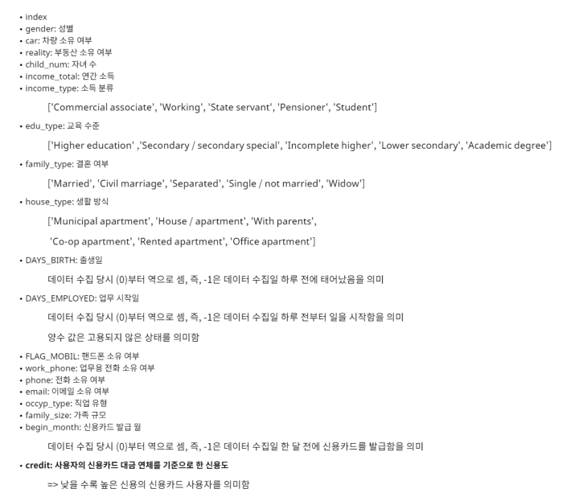
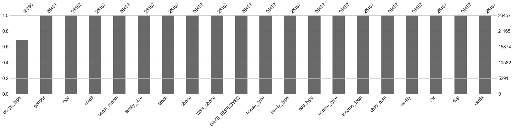
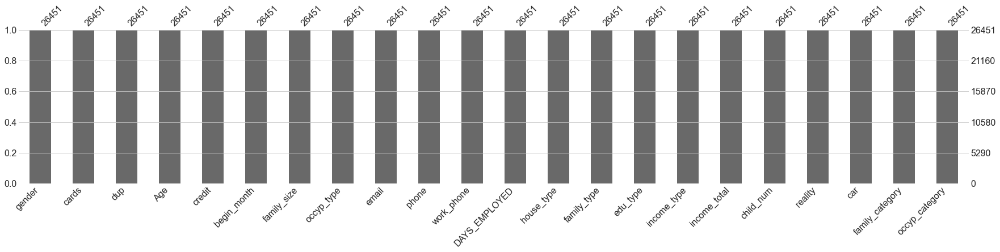
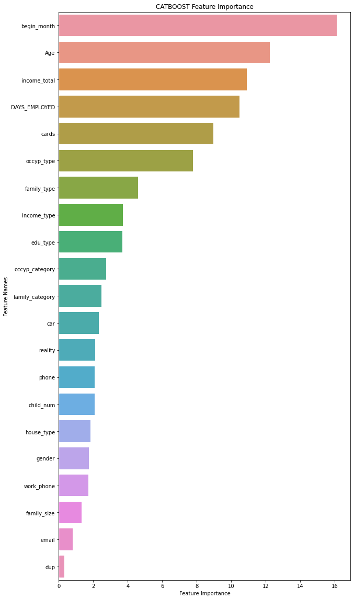

# 신용카드 사용자 연체 예측(AI SCHOOL 5기 Semi-project3)
기간 : 2022-05-02 ~ 2022-05-10  
팀원 : 김나리(팀장), 서민정, 이찬영, 전준용, 정연준

---
## 데이터 출처
[🙌DACON 신용카드 사용자 연체 예측 AI 경진대회](https://dacon.io/competitions/official/235713/overview/description)
## 데이터 해설
<p align="center"></p>

## 01. 데이터 전처리
- **binary**
    - gender
    - car
    - reality
    - work_phone
    - phone
    - email
    - ~~Flag_mobil : drop~~
    - (new) dup: 여러 카드 발행 여부

- **numeric → standard scaler 적용**
    - child_num : 처리 안함 (보류)
    - family_size : 처리 안함, 이상치 안지우고 (보류)
    - ~~(new) adult_num : family_size - child_num(logloss 상승 by준용)~~
    - income_total : log 변환 (체크해볼것)
    - age : np.abs(DAYS_BIRTH) / 365
    - DAYS_EMPLOYED : 양수는 = 0 , 음수는 → np.abs(DAYS_EMPLOYED)
    - begin_MONTH : np.abs(begin_MONTH)
    - (new) cards : 해당 유저가 몇개의 카드를 소지하고 있는지
    
- **categorical**
    - income_type
    - edu_type
    - family_type
    - house_type
    - occyp_type 찬영) 넣었을 때와 뺐을 때 차이가 있어서 빼서 해봄.
        - 공통 ⇒ 업무일수 0이면 unemployed
        - 나머지 결측치 채우는 방법 (보류)
            - 1안: 최빈값으로 채우기(처음에 다같이 생각한 방식)
            - 2안: GBC로 추정해서 채워 넣기
                - 독립변수 : ['Age','income_total','income_type','edu_type','house_type', 'work_phone','gender','car','reality']
                - 종속변수: ‘occyp_type’

### occyp_type열 결측치 채우기 논의
- occyp_type 결측치 → 8171개  
- DAYS_EMPLOYED로 양수값 무직 처리하면 → 3700개 남음  
- income_type열을 기반으로 income_type의 value가 Commercial associate 이면 그 중에서 가장 많은 직업을 결측치에 넣는 형식으로 하기로 함  
- 결측치를 포함하지않은 열을 GBC로 학습시켜 결측치를 예측하여 채웠으나 성능이 미세하게 덜 나와서 기각함

**occyp_type 결측치 채우기**  
결측치 확인(missingno)
<p align="center"></p>   

**코드**    
```python
# income_type의 value 리스트
income_list = list(set(data_df['income_type'].values))

#income_type별로 가장 많은 occyp_type값을 리스트로 만듬
occyp_list = []
for i in income_list:
    occyp_list.append(data_df[data_df['income_type']== i]['occyp_type'].value_counts().index[0])

# 직업 종류 결측치 income_type으로 채우기
for i in data_df[data_df['occyp_type'].isnull()].index:
    if data_df['DAYS_EMPLOYED'][i] > 0:
        data_df['occyp_type'][i] = 'Unemployed'
    else:
        for income in income_list:
            if income == data_df['income_type'][i]:
                data_df['occyp_type'][i] = data_df[data_df['income_type']== income]['occyp_type'].value_counts().index[0]
data_df['occyp_type']
```   
결측치 채운 후
<p align="center"></p>

## 02. 각 후보 feature별 logloss비교
- adult_num : 가족수에서 아이수를 뺀 성인수를 따로 만들어보았음  
-> 성능의 큰 변화가 없어서 제외
- child_num : 필요함. 대신 0, 1, 다자녀 카테고리컬 변수로 수정 후 이용
- family_size :  
    - 7인 초과 가족은 이상치로 보고 제거  
    - 이후, 3개 카테고리 분류    
        - 1명 : 싱글  
        - 2~3명 : 핵가족  
        - 4명 이상 : 대가족  
<p align="center"></p>

## 03. Machine Learning
k-fold를 활용하여 평균 logloss 계산
```python
test_size = 0.2
random_state = 0
num_folds= 5 # test_size = 0.2
str_kf = StratifiedKFold(n_splits = num_folds, shuffle = True, random_state = random_state)
```

**CATBOOST** Classifier모델이 가장 성능이 잘나옴
```python
logloss_history = []
accuracy_history = []

for train_index, test_index in str_kf.split(credit_X, credit_Y):
    X_train, X_test = credit_X.loc[train_index], credit_X.loc[test_index]
    y_train, y_test = credit_Y.loc[train_index], credit_Y.loc[test_index]

    x_train_transformed , x_test_transformed, preprocessor = pipe_processing(X_train, X_test)
    new_col_names = get_feature_names(preprocessor)
    x_train_transformed = pd.DataFrame(x_train_transformed,columns=new_col_names)
    x_test_transformed = pd.DataFrame(x_test_transformed,columns=new_col_names)

    model = CatBoostClassifier(iterations = 2000, random_state=random_state,)
    model.fit(x_train_transformed, y_train, eval_set=(x_test_transformed, y_test) , use_best_model=True, early_stopping_rounds=100, verbose=100) # <- x_train_transformed (not x_train)
    
    y_pred_proba = model.predict_proba(x_test_transformed)
    y_pred = model.predict(x_test_transformed) # 예측 라벨
    logloss_history.append(log_loss(y_test,y_pred_proba)) # logloss측정 및 기록
    accuracy_history.append(accuracy_score(y_pred, y_test)) # 정확도 측정 및 기록
print("각 분할의 logloss 기록 :", logloss_history)    
print("각 분할의 정확도 기록 :", accuracy_history)
print("평균 logloss :", np.mean(logloss_history))
print("평균 정확도 :", np.mean(accuracy_history))   
```
<p align="center"></p>

**feature imoprtance**
<p align="center"></p>


## 04. Deep Learning


```python
logloss_history = []
accuracy_history = []
fold_no = 1
for train_index, test_index in str_kf.split(credit_X, credit_Y):
    X_train, X_test = credit_X.loc[train_index], credit_X.loc[test_index]
    y_train, y_test = credit_Y.loc[train_index], credit_Y.loc[test_index]
    
    x_train_transformed , x_test_transformed, preprocessor = pipe_processing(X_train, X_test)
#     new_col_names = get_feature_names(preprocessor)
#     x_train_transformed = pd.DataFrame(x_train_transformed,columns=new_col_names)
#     x_test_transformed = pd.DataFrame(x_test_transformed,columns=new_col_names)
    train_label = utils.to_categorical(y_train) # 0~2-> one-hot vector
    test_label = utils.to_categorical(y_test) # 0~2 -> one-hot vector
    
    model = models.Sequential() 

    model.add(layers.Flatten())
    model.add(layers.Dense(units=256, activation=None, kernel_initializer=initializers.he_normal())) 
    model.add(layers.BatchNormalization()) # BN은 적용하려면 매 레이어마다 해주는 것이 좋다.
    model.add(layers.Activation('elu')) # layers.ELU or layers.LeakyReLU

    model.add(layers.Dense(units=512, activation=None, kernel_initializer=initializers.he_normal())) 
    model.add(layers.BatchNormalization())
    model.add(layers.Activation('elu')) # layers.ELU or layers.LeakyReLU

    model.add(layers.Dense(units=256, activation=None, kernel_initializer=initializers.he_normal())) 
    model.add(layers.BatchNormalization())
    model.add(layers.Activation('elu'))
    model.add(layers.Dropout(rate=0.5))

    model.add(layers.Dense(units=256, activation=None, kernel_initializer=initializers.he_normal())) 
    model.add(layers.BatchNormalization())
    model.add(layers.Activation('elu'))
    model.add(layers.Dropout(rate=0.5))

    model.add(layers.Dense(units=3, activation='softmax')) # 0~2 

    model.compile(optimizer=optimizers.RMSprop(),# 함수에 인자로 learning Rate 적용 가능 
                  loss=losses.categorical_crossentropy, 
                  metrics=[metrics.categorical_accuracy])
    # Generate a print
    print('------------------------------------------------------------------------')
    print(f'Training for fold {fold_no} ...')

    # Fit data to model
    history = model.fit(x_train_transformed, train_label, batch_size=100, epochs=30, verbose = 0) 
    # Generate generalization metrics
    scores = model.evaluate(x_test_transformed, test_label, verbose=0)
    print(f'Score for fold {fold_no}: {model.metrics_names[0]} of {scores[0]}; {model.metrics_names[1]} of {scores[1]*100}%')
    accuracy_history.append(scores[1] * 100)
    logloss_history.append(scores[0])

    # Increase fold number
    fold_no = fold_no + 1
```
<p align="center"></p>

하이퍼파라미터 최적화를 위해 **Keras tuner** 활용
### 04_01. Keras tuner (BayesianOptimization)
```python
tuner = kt.BayesianOptimization(build_hyper_model,
                                objective = kt.Objective('val_loss','min'), # Hyper-params tuning을 위한 목적함수 설정 (metric to minimize or maximize)
                                max_trials = 30, # 서로 다른 Hyper-params 조합으로 시도할 총 Trial 횟수 설정
                                directory = 'test_prac_dir', # Path to the working directory
                                project_name = 'Credit_hyper_2(final)') # Name to use as directory name for files saved by this Tuner
```


### 04_01. Keras tuner (Hyperband)
```python
# Hyperband
tuner = kt.Hyperband(model_builder,
                     objective = kt.Objective('val_loss','min'), 
                     max_epochs = 30,
                     factor = 3,
                     directory = 'test_prac_dir', # Path to the working directory
                     project_name = 'Credit_hyperband')
```
